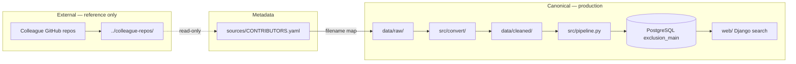

# Project Layout

One-page map of the Medicaid exclusion list ETL repository (39 states + federal LEIE).

## Architecture



## What is canonical?

**Canonical** paths are the only inputs/outputs used by `python3 -m src.pipeline` and remote deploy:

| Path | Contents |
|------|----------|
| `data/raw/` | 41 source files (39 states + LEIE; state PDFs/xlsx/csv) |
| `data/processed/` | State-native `*_raw.csv` |
| `data/cleaned/` | OIG-mapped `*_oig.csv` + `federal_oig.csv` |
| `src/convert/` | Per-state converters + `federal_leie.py` |
| `sql/` | Stage tables, merge, verify |
| `web/` | Django search UI (production web layer) |

## What is archive / reference?

| Path | Role |
|------|------|
| `../colleague-repos/` | Local git clones for diff; **not** read by pipeline |
| `sources/` | Contributor registry (YAML + README per person) |
| `docs/project/` | Public policy only (`uncovered_states.json`); other ops notes stay local |
| `docs/artifacts/` | Local pipeline JSON (gitignored; regenerable) |

**Rule:** Copy raw files from colleague repos into `data/raw/` with exact names, then run ETL. Never load colleague cleaned CSVs directly.

## Documentation layout

```
docs/
├── guides/           # Human-readable runbooks (WORKFLOW, STATE_MAPPING, …)
├── project/          # uncovered_states.json (12 states not yet integrated)
└── artifacts/        # Local pipeline JSON (gitignored)
```

## Contributors (39 + LEIE)

See [`sources/CONTRIBUTORS.yaml`](../../sources/CONTRIBUTORS.yaml) for the full mapping.

| Contributor | States | Records (cleaned) |
|-------------|--------|-------------------|
| Xinzhuo Li | MD–NE (6) | 8,575 |
| AustinGH32 | CA, NY, NC, ND, OH, NJ, PA | 44,997 |
| le-luo327 | GA–ME (10) | 13,917 |
| AmeeBeez | AL–FL excl. CA (9) | 90,580 |
| FredericYan02 | SC–WY (7) | 15,242 |
| le-luo327 (federal) | OIG LEIE | 83,464 |
| **Total** | **39 + federal** | **256,776** |

## Key commands

```bash
pip install -r requirements.txt
python3 -m pytest tests/ -q
python3 -m src.pipeline --skip-db          # convert + validate
python3 -m src.pipeline                    # full + PostgreSQL
bash scripts/import_local.sh --states-only
bash deploy/sync_and_merge_noninteractive.sh   # optional remote deploy
```

Uncovered states: [`docs/project/uncovered_states.json`](../project/uncovered_states.json).
