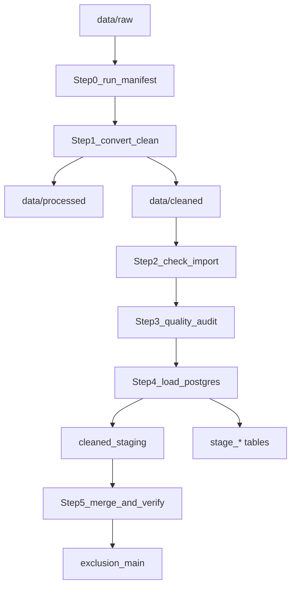

# ETL Workflow Runbook

**39-state import guide:** see [IMPORT_RUNBOOK.md](IMPORT_RUNBOOK.md).  
**Name fields:** [NAME_HANDLING.md](NAME_HANDLING.md).

Detailed operator guide for the Medicaid exclusion list pipeline. For a quick start, see [README.md](../README.md).

**Repository:** https://github.com/Xinzhuo-Li/exclusion-list

---

## First-Time Setup Checklist

1. **Clone the repository**
   ```bash
   git clone https://github.com/Xinzhuo-Li/exclusion-list.git
   cd exclusion-list
   ```

2. **Install Python dependencies** (Python 3.10+ required)
   ```bash
   pip3 install -r requirements.txt
   ```

3. **Verify source files** — confirm all 41 raw files exist in `data/raw/` (see [data/raw/README.md](../data/raw/README.md)).

4. **Configure PostgreSQL** (skip if using `--skip-db` only)
   ```bash
   cp .env.example .env
   # Edit .env: PGHOST, PGPORT, PGDATABASE, PGUSER, PGPASSWORD
   ```
   Create the database if it does not exist:
   ```bash
   createdb exclusion_list
   # or: psql -c "CREATE DATABASE exclusion_list;"
   ```

5. **Run tests**
   ```bash
   python3 -m pytest tests/ -v
   ```

6. **Dry run (no database)**
   ```bash
   python3 -m src.pipeline --skip-db
   ```

7. **Full run** (when `.env` is configured)
   ```bash
   python3 -m src.pipeline
   ```

---

## Pipeline Overview (Steps 0–5)

The orchestrator is `python3 -m src.pipeline`. It runs these steps in order:

| Step | Name | Module | Fail-fast? |
|------|------|--------|------------|
| 0 | Run manifest | `src.validate.run_manifest` | No |
| 1 | Convert & clean | `src.convert.run_all` | Yes (Python exception) |
| 2 | Import validation | `src.validate.check_import` | Yes |
| 3 | Quality audit | `src.validate.quality_audit` | Yes |
| 4 | Load PostgreSQL | `src.load.load_to_postgres` | Yes |
| 5 | Merge & verify sync | `sql/03_merge_to_main.sql` + `verify_main_sync()` | Yes |



### CLI flags

| Flag | Effect |
|------|--------|
| `--skip-nebraska` | Skip NE PDF conversion in Steps 0–1 |
| `--skip-db` | Stop after Step 3 (no PostgreSQL load or merge) |
| `--skip-merge` | Run Step 4 only; do not merge into `exclusion_main` |

---

## Step 0 — Run Manifest

**Purpose:** Record SHA256 hashes and file sizes of raw source files for auditability.

**Automatic:** Runs at the start of `src.pipeline`.

**Manual:**
```bash
python3 -c "from src.validate.run_manifest import write_run_manifest; write_run_manifest()"
```

**Output:** `docs/artifacts/runs/YYYYMMDD/run_manifest_YYYYMMDD_HHMMSS.json`

**How to use:** Compare manifests across runs to see whether source files changed. Each entry includes `state`, `filename`, `sha256`, `size_bytes`, and optional `source_row_hint`.

---

## Step 1 — Convert & Clean

**Purpose:** Read raw xlsx/pdf files, normalize to OIG LEIE schema, write CSV outputs.

**Automatic:** `python3 -m src.pipeline` (Step 1).

**Manual — all states:**
```bash
python3 -m src.convert.run_all
```

**Manual — single state:**
```bash
python3 -m src.convert.maryland
python3 -m src.convert.massachusetts
python3 -m src.convert.michigan
python3 -m src.convert.mississippi
python3 -m src.convert.montana
python3 -m src.convert.nebraska
```

**Outputs:**

| Output | Path |
|--------|------|
| Processed (state-native columns) | `data/processed/{state}_raw.csv` |
| Cleaned (OIG-mapped) | `data/cleaned/{state}_oig.csv` |
| Dedup logs (if any dropped) | `docs/artifacts/dedup/dedup_dropped_{state}.json` |

**Key transforms:** See [STATE_MAPPING.md](STATE_MAPPING.md) and [ISSUES_AND_DECISIONS_BILINGUAL.md](ISSUES_AND_DECISIONS_BILINGUAL.md).

---

## Step 2 — Import Validation

**Purpose:** Check row counts, NPI/date rates, and fixed-field lengths against expected baselines.

**Manual:**
```bash
python3 -m src.validate.check_import
```

**Output:** `docs/artifacts/runs/YYYYMMDD/validation_report_YYYYMMDD_HHMMSS.json`

**Pass criteria (per state):**
- Processed and cleaned row counts within ±5 of baseline (see `STATE_EXPECTATIONS` in `src/validate/check_import.py`)
- NPI fill rate and EXCLDATE fill rate above state minimums
- Date format valid (YYYYMMDD or empty)
- Fixed fields (NPI, dates, state, zip) within OIG max lengths

**If validation fails:** Open the latest `validation_report_*.json`, inspect `"checks"` and `"passed"` for the failing state.

---

## Step 3 — Quality Audit

**Purpose:** Re-run converters from raw source and compare output to saved cleaned CSVs (rerun consistency).

**Manual:**
```bash
python3 -m src.validate.quality_audit
```

**Output:** `docs/artifacts/runs/YYYYMMDD/quality_audit_YYYYMMDD_HHMMSS.json`

**Pass criteria:** `"all_reruns_consistent": true` — every state's rerun matches the on-disk cleaned CSV by identity key.

**If audit fails:** Check `"rerun_consistency"` for `missing_in_csv`, `extra_in_csv`, or `field_mismatches`. Common causes:
- Cleaned CSV edited manually
- Code changed since last convert
- Raw source file updated but CSV not regenerated

---

## Step 4 — Load PostgreSQL

**Purpose:** Apply schema, truncate stage tables, load processed and cleaned CSVs.

**Manual:**
```bash
python3 -m src.load.load_to_postgres
```

**What it does:**
1. Runs `sql/01_create_stage_tables.sql` and `sql/02_create_main_table.sql` (DROP/CREATE)
2. Truncates and loads six `stage_*` tables from `data/processed/*_raw.csv`
3. Truncates and loads `cleaned_staging` from `data/cleaned/*_oig.csv`

**Requires:** Valid `.env` with PostgreSQL credentials.

**Tables created:**

| Table | Source |
|-------|--------|
| `stage_maryland` … `stage_nebraska` | `data/processed/*_raw.csv` |
| `cleaned_staging` | `data/cleaned/*_oig.csv` |
| `exclusion_main` | Empty until Step 5 |

---

## Step 5 — Merge & Verify Sync

**Purpose:** Replace loaded state/federal slices in `exclusion_main` from `cleaned_staging`, then assert strict sync.

**Automatic:** Final steps of `python3 -m src.pipeline`.

**Manual merge:**
```bash
psql -h $PGHOST -p $PGPORT -U $PGUSER -d $PGDATABASE -f sql/03_merge_to_main.sql
```

**Manual verify (SQL only):**
```bash
psql -h $PGHOST -p $PGPORT -U $PGUSER -d $PGDATABASE -f sql/04_verify_main_sync.sql
```

The pipeline's `verify_main_sync()` runs equivalent EXCEPT queries in Python and **exits with code 1** if:
- Row counts differ between `cleaned_staging` and `exclusion_main`
- Any business column diff exists in either direction

**Merge policy:** DELETE rows for MD/MA/MI/MS/MT/NE from `exclusion_main`, then INSERT all rows from `cleaned_staging`. Other states in `exclusion_main` (if any) are untouched.

---

## Updating Source Data & Baselines

When a state publishes a new exclusion list:

1. Replace the file in `data/raw/` (keep the exact filename).
2. Run `python3 -m src.pipeline --skip-db`.
3. Review new counts in terminal output and the latest `docs/artifacts/runs/YYYYMMDD/validation_report_*.json`.
4. If counts changed **intentionally**, update baselines in two places:
   - `STATE_EXPECTATIONS` in `src/validate/check_import.py` (`processed_expected`, `cleaned_expected`)
   - Record counts table in `docs/guides/DATA_INVENTORY.md`
5. Run `python3 -m pytest tests/test_record_counts.py -v` after updating baselines.
6. Run full pipeline with database when ready.

---

## Interpreting JSON Reports

### `validation_report_*.json`

```json
{
  "state": "MD",
  "processed_rows": 1605,
  "cleaned_rows": 1603,
  "checks": {
    "processed_count_ok": true,
    "cleaned_count_ok": true,
    "npi_rate_ok": true,
    "excldate_rate_ok": true,
    "date_format_ok": true,
    "field_length_ok": true
  },
  "passed": true
}
```

### `quality_audit_*.json`

Key fields:
- `summary.all_reruns_consistent` — must be `true`
- `rerun_consistency[].consistent` — per-state pass/fail
- `format_checks[].long_busname_count` — informational (names > 30 chars, not truncated)

### `run_manifest_*.json`

Use `files[].sha256` to confirm which version of each source file was used.

### `dedup_dropped_{state}.json`

Lists exact-duplicate records removed during cleaning (all 16 identity fields identical).

---

## Testing

```bash
# All tests
python3 -m pytest tests/ -v

# Core transforms only
python3 -m pytest tests/test_common_dates.py tests/test_michigan_dates.py -v

# Record count regression (requires processed/cleaned CSVs in repo)
python3 -m pytest tests/test_record_counts.py -v
```

---

## Remote Deployment (Optional)

For syncing to a Linux server (e.g. production PostgreSQL on vesta):

1. Copy `deploy/config.example.sh` to `deploy/config.sh` (gitignored).
2. Set `DEPLOY_HOST`, `DEPLOY_REMOTE_DIR`, `PGPORT`.
3. Use `deploy/sync_and_merge_noninteractive.sh` to rsync code and run load + merge on the server.

See scripts in `deploy/` for server setup, upload, and verification helpers. These scripts are environment-specific (SSH host, Mac `expect`/`osascript` prompts) — adapt before use on other machines.

---

## Django Web Application

The `web/` directory contains a Django search UI and REST API that reads from `exclusion_main`. It does not modify ETL data — new states added via the pipeline appear automatically in search and API results.

### Local development

1. Ensure PostgreSQL is loaded (`python3 -m src.pipeline` or existing data in `exclusion_main`).
2. Configure `.env` (copy from `.env.example`; includes `DJANGO_SECRET_KEY`, `PG*` vars).
3. Install dependencies and run migrations:

   ```bash
   pip3 install -r requirements.txt
   cd web
   python manage.py migrate
   python manage.py refresh_sources   # optional metadata table
   python manage.py runserver
   ```

4. Open http://127.0.0.1:8000/ for the web UI; http://127.0.0.1:8000/api/docs/ for API documentation.

### Pages and API

| Path | Description |
|------|-------------|
| `/` | Project home with coverage stats |
| `/search/` | Exclusion list search |
| `/usage/` | Usage guide and API examples |
| `/contact/` | Contact information |
| `/api/v1/exclusions/` | REST search (JSON) |
| `/api/v1/sources/` | Available data sources |
| `/api/v1/stats/` | Summary statistics |
| `/api/docs/` | Swagger UI |

### Production deployment (vesta)

```bash
# On server, after ETL merge:
bash deploy/django_setup.sh

# Optional: systemd + nginx
sudo cp deploy/exclusion-web.service.example /etc/systemd/system/exclusion-web.service
sudo cp deploy/nginx.conf.example /etc/nginx/sites-available/exclusion-web
sudo systemctl enable --now exclusion-web
```

After each ETL merge, the web app reads updated data immediately. Optionally refresh metadata:

```bash
cd web && python manage.py refresh_sources
```

### Web tests

```bash
python3 -m pytest web/tests/ -v
```

---

## Troubleshooting

| Symptom | Likely cause | Action |
|---------|--------------|--------|
| `FileNotFoundError: data/raw/Maryland.xlsx` | Missing or misnamed source file | Check [data/raw/README.md](../data/raw/README.md) |
| Validation failed for MD | Row count drift | Compare counts; update `STATE_EXPECTATIONS` if source updated |
| Quality audit INCONSISTENT | Stale CSV or code change | Re-run Step 1: `python3 -m src.convert.run_all` |
| `psycopg2.OperationalError` | Bad `.env` or DB down | Verify credentials; test with `psql` |
| Sync verification failed | Merge incomplete | Re-run `sql/03_merge_to_main.sql`; check `04_verify_main_sync.sql` output |
| Nebraska step slow/fails | PDF layout change | Inspect PDF; update `src/convert/nebraska.py` |

---

## Related Documentation

- [DATA_INVENTORY.md](DATA_INVENTORY.md) — column inventory and record counts
- [STATE_MAPPING.md](STATE_MAPPING.md) — per-state OIG field mapping
- [ISSUES_AND_DECISIONS_BILINGUAL.md](ISSUES_AND_DECISIONS_BILINGUAL.md) — business rules and leadership decisions (EN + 中文)
